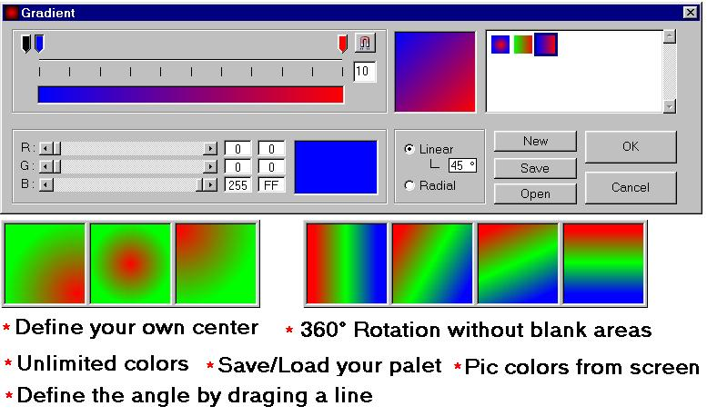



## \[\*\*\*Gradient painter Liniair\+Angle / Radial\*\*\*\]

### Description

V 1.2 This is the most advanced gradient painter on PSC it can paint a liniair gradient in any angle WITHOUT blank areas!!! but that's not all you can also paint a radial gradient and define youre own center!!!
 
### More Info
 

             |
---                |---
**Submitted On**   |2002-05-02 13:26:38
**By**             |[PowerSoft](https://github.com/Planet-Source-Code/PSCIndex/blob/master/ByAuthor/powersoft.md)
**Level**          |Advanced
**User Rating**    |4.6 (153 globes from 33 users)
**Compatibility**  |VB 5\.0, VB 6\.0
**Category**       |[Graphics](https://github.com/Planet-Source-Code/PSCIndex/blob/master/ByCategory/graphics__1-46.md)
**World**          |[Visual Basic](https://github.com/Planet-Source-Code/PSCIndex/blob/master/ByWorld/visual-basic.md)
**Archive File**   |[\[\_\_\_Gradie78446522002\.zip](https://github.com/Planet-Source-Code/powersoft-gradient-painter-liniair-angle-radial__1-33973/archive/master.zip)

